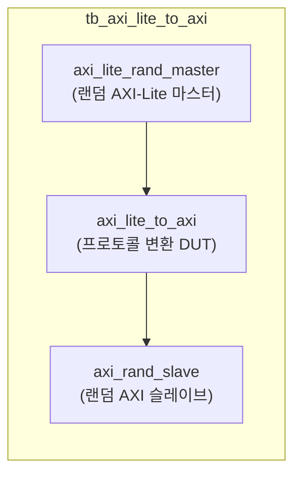
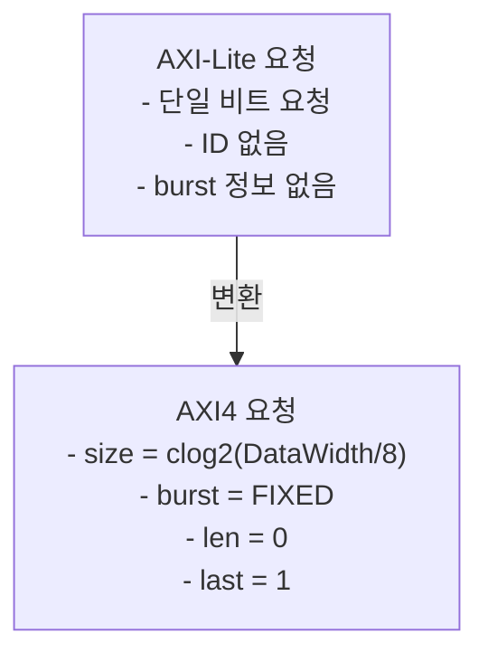

# tb_axi_lite_to_axi.sv

## 개요

`axi_lite_to_axi` 모듈의 테스트벤치입니다. AXI4-Lite에서 AXI4 풀 프로토콜로의 변환이 올바른지 검증합니다.

## 테스트 구성

## 파라미터

| 파라미터 | 기본값 | 설명 |
|---------|--------|------|
| `TB_AW` | 32 | 주소 폭 (Address Width) |
| `TB_DW` | 32 | 데이터 폭 (Data Width) |
| `TB_IW` | 8 | ID 폭 (ID Width) |
| `TB_UW` | 8 | 사용자 신호 폭 (User Width) |
| `tCK` | 1ns | 클록 주기 |

## 변환 규칙

## 테스트 시나리오

1. 랜덤 AXI-Lite 마스터가 읽기/쓰기 트랜잭션 생성
2. `axi_lite_to_axi`가 AXI-Lite → AXI4 변환
   - `size` = clog2(DataWidth/8)로 고정
   - `burst` = FIXED (0)
   - `len` = 0 (단일 비트)
   - `last` = 1
3. AXI4 슬레이브가 응답 생성
4. 응답이 올바르게 AXI-Lite 마스터로 전달되는지 검증

## 검증 대상

`axi_lite_to_axi`: AXI4-Lite → AXI4 업그레이드 어댑터

## 의존성

- `axi/typedef.svh`, `axi/assign.svh`
- `axi_test`
