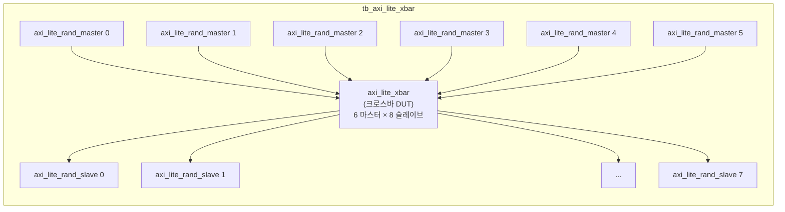
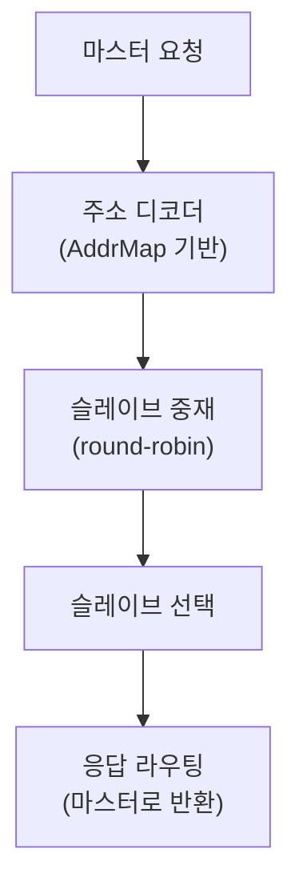

# tb_axi_lite_xbar.sv

## 개요

`axi_lite_xbar` 모듈의 테스트벤치입니다. AXI4-Lite 크로스바의 다중 마스터-슬레이브 라우팅이 올바른지 검증합니다.

## 테스트 구성

## 파라미터

| 파라미터 | 기본값 | 설명 |
|---------|--------|------|
| `NoMasters` | 6 | 마스터 포트 수 |
| `NoSlaves` | 8 | 슬레이브 포트 수 |
| `NoWrites` | 10000 | 마스터당 쓰기 트랜잭션 수 |
| `NoReads` | 10000 | 마스터당 읽기 트랜잭션 수 |

## 내부 설정

| 파라미터 | 값 | 설명 |
|---------|-----|------|
| `AxiAddrWidth` | 32 | 주소 폭 |
| `AxiDataWidth` | 64 | 데이터 폭 |
| `CyclTime` | 10ns | 클록 주기 |

## 크로스바 라우팅

## 테스트 시나리오

1. 6개의 랜덤 AXI-Lite 마스터가 각각 10000 쓰기 + 10000 읽기 트랜잭션 생성
2. 크로스바가 주소 기반으로 8개 슬레이브 중 적절한 슬레이브로 라우팅
3. 동시 접근 충돌 시 라운드로빈 중재
4. 8개 랜덤 AXI-Lite 슬레이브가 응답 생성
5. 모든 트랜잭션의 데이터 정합성 및 완료 검증

## 검증 대상

`axi_lite_xbar`: AXI4-Lite 완전 연결 크로스바 (6×8)

## 의존성

- `axi/typedef.svh`, `axi/assign.svh`
- `axi_test`
