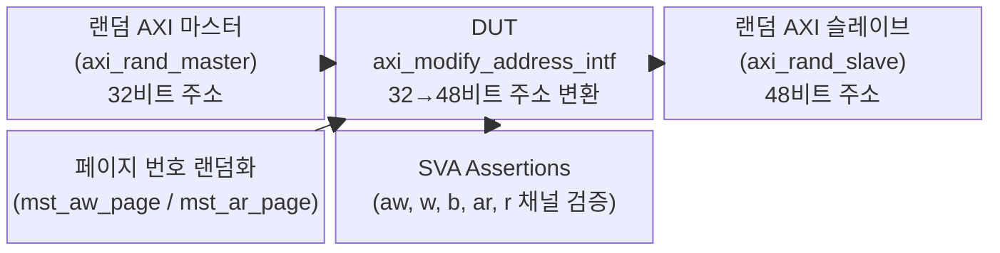
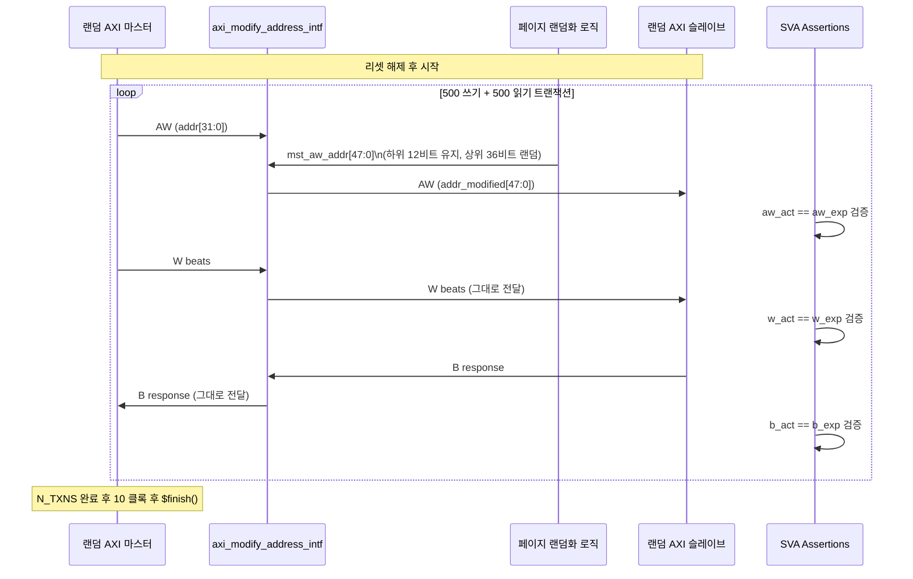

# tb_axi_modify_address.sv 테스트벤치 문서

## 1. 테스트벤치 목적 및 개요

`tb_axi_modify_address`는 `axi_modify_address` 모듈을 검증하기 위한 테스트벤치입니다. 이 테스트벤치는 AXI4 버스에서 슬레이브 포트와 마스터 포트 사이의 주소 너비가 다를 때, 주소 변환(업스트림 32비트 → 다운스트림 48비트)이 올바르게 수행되는지 확인합니다.

테스트는 다음 방식으로 동작합니다:
- 랜덤 AXI 마스터가 32비트 주소로 트랜잭션을 생성합니다.
- DUT(`axi_modify_address_intf`)는 페이지 오프셋(하위 12비트)을 유지하면서 상위 페이지 번호를 외부에서 주입된 랜덤 값으로 교체합니다.
- SystemVerilog `assert property`를 사용하여 모든 채널(AW, W, B, AR, R)의 실제 신호가 예상 값과 일치하는지 검사합니다.

**저자:** Andreas Kurth (ETH Zurich / University of Bologna)
**라이센스:** Solderpad Hardware License v0.51

---

## 2. 테스트 대상 모듈

| 모듈명 | 설명 |
|--------|------|
| `axi_modify_address_intf` | AXI 슬레이브 포트의 주소를 외부에서 입력된 주소로 교체하여 마스터 포트로 전달하는 모듈. 주소 너비 변환(32→48비트)을 지원함 |

---

## 3. 주요 파라미터 및 설정

### DUT 파라미터

| 파라미터 | 기본값 | 설명 |
|---------|--------|------|
| `AXI_SLV_PORT_ADDR_WIDTH` | 32 | 슬레이브 포트(업스트림) 주소 너비 (비트) |
| `AXI_MST_PORT_ADDR_WIDTH` | 48 | 마스터 포트(다운스트림) 주소 너비 (비트) |
| `AXI_DATA_WIDTH` | 64 | 데이터 너비 (비트) |
| `AXI_ID_WIDTH` | 3 | AXI ID 너비 (비트) |
| `AXI_USER_WIDTH` | 2 | AXI USER 필드 너비 (비트) |

### 테스트벤치 타이밍 파라미터

| 파라미터 | 기본값 | 설명 |
|---------|--------|------|
| `TCLK` | 10ns | 클록 주기 |
| `TA` | TCLK × 1/4 = 2.5ns | 자극 인가 시간 (Apply time) |
| `TT` | TCLK × 3/4 = 7.5ns | 샘플링 시간 (Test time) |
| `REQ_MIN_WAIT_CYCLES` | 0 | 요청 채널 최소 대기 사이클 |
| `REQ_MAX_WAIT_CYCLES` | 10 | 요청 채널 최대 대기 사이클 |
| `RESP_MIN_WAIT_CYCLES` | 0 | 응답 채널 최소 대기 사이클 |
| `RESP_MAX_WAIT_CYCLES` | 5 | 응답 채널 최대 대기 사이클 |
| `N_TXNS` | 1000 | 총 트랜잭션 수 (읽기 500 + 쓰기 500) |

---

## 4. 테스트 시나리오 설명

### 시나리오 1: 랜덤 쓰기 트랜잭션 주소 변환 검증
- 랜덤 마스터가 32비트 업스트림 주소로 AW 채널 트랜잭션을 발행합니다.
- 테스트벤치는 클록마다 `mst_aw_page`를 새로운 랜덤 값으로 업데이트합니다.
- DUT는 AW 주소 하위 12비트(페이지 오프셋)는 그대로 유지하고, 상위 비트는 `mst_aw_addr`로 교체합니다.
- SVA `aw` assertion으로 실제 다운스트림 AW 주소와 예상 주소가 일치하는지 검증합니다.

### 시나리오 2: 랜덤 읽기 트랜잭션 주소 변환 검증
- 랜덤 마스터가 32비트 업스트림 주소로 AR 채널 트랜잭션을 발행합니다.
- 동일하게 `mst_ar_page`가 랜덤하게 변경되며 AR 주소 변환을 검증합니다.
- SVA `ar` assertion으로 실제 다운스트림 AR 주소와 예상 주소가 일치하는지 검증합니다.

### 시나리오 3: W/B/R 채널 투명 전달 검증
- W 채널 데이터, B 응답, R 응답이 변환 없이 투명하게 전달되는지 검증합니다.
- SVA `w`, `b`, `r` assertion으로 각각 실시간으로 비교합니다.

### 검증 방법 (SVA Assertions)

```systemverilog
aw: assert property(@(posedge clk)
  downstream.aw_valid |-> aw_act == aw_exp)
  else $error("AW %p != %p!", aw_act, aw_exp);
```

리셋 비활성화 시(`~rst_n`) assertion은 자동 비활성됩니다(`default disable iff`).

---

## 5. Mermaid 다이어그램

### 테스트 구조도



### 트랜잭션 시퀀스 다이어그램



---

## 6. 실행 방법

### 사전 요구사항
- SystemVerilog 지원 시뮬레이터 (VCS, Questa, Xcelium 등)
- `axi/` 라이브러리 (ETH Zurich `axi` IP 패키지)
- `axi_test` 패키지 (`axi_rand_master`, `axi_rand_slave` 클래스 포함)
- `clk_rst_gen` 모듈

### Bender를 이용한 빌드 및 시뮬레이션 (권장)

```bash
# 의존성 설치
bender install

# 시뮬레이션 스크립트 생성 (예: Questa)
bender script questa -t test > compile.tcl

# Questa에서 실행
vsim -do compile.tcl tb_axi_modify_address
```

### VCS 직접 실행 예시

```bash
vcs -sverilog -full64 \
    +incdir+include \
    tb_axi_modify_address.sv \
    -top tb_axi_modify_address \
    -o simv

./simv +N_TXNS=1000
```

### 파라미터 오버라이드 예시

```bash
# 트랜잭션 수를 500으로 줄여서 빠르게 테스트
./simv +N_TXNS=500

# 주소 너비 변경
# (컴파일 타임 파라미터이므로 컴파일 시 지정)
vcs ... -pvalue+AXI_SLV_PORT_ADDR_WIDTH=32 \
        -pvalue+AXI_MST_PORT_ADDR_WIDTH=64
```

### 성공 조건
- 시뮬레이션이 `$finish()`로 정상 종료됨
- `$error` 메시지 없이 모든 SVA assertion 통과
- AW, W, B, AR, R 채널 모두 예상 값과 실제 값이 일치
