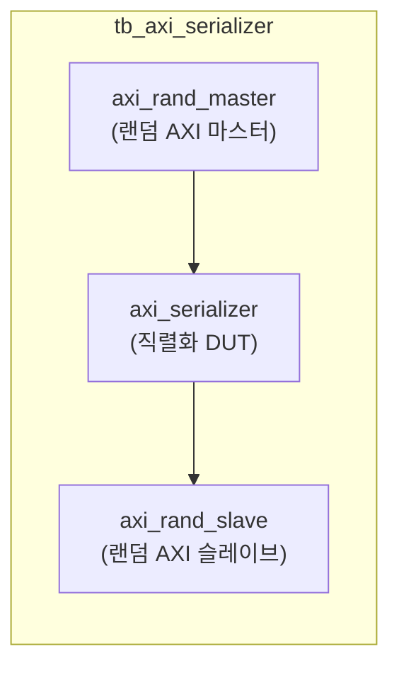
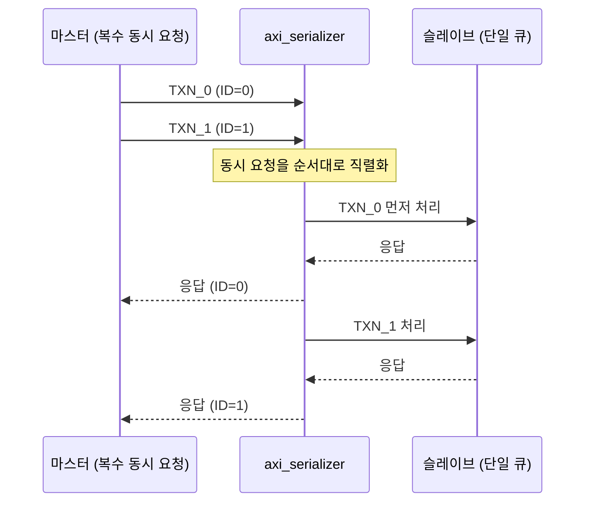

# tb_axi_serializer.sv

## 개요

`axi_serializer` 모듈의 테스트벤치입니다. AXI 트랜잭션 직렬화(serialization) 동작이 올바른지 검증합니다.

## 테스트 구성

## 파라미터

| 파라미터 | 기본값 | 설명 |
|---------|--------|------|
| `NoWrites` | 5000 | 총 쓰기 트랜잭션 수 |
| `NoReads` | 3000 | 총 읽기 트랜잭션 수 |

## 내부 설정

| 파라미터 | 값 | 설명 |
|---------|-----|------|
| `NoPendingDut` | 4 | DUT 최대 동시 보류 트랜잭션 수 |
| `MaxAW`, `MaxAR` | 30 | 최대 동시 트랜잭션 |
| `EnAtop` | `1'b1` | ATOP 활성화 |
| `CyclTime` | 10ns | 클록 주기 |
| `ApplTime` | 2ns | 신호 적용 지연 |
| `TestTime` | 8ns | 신호 테스트 지연 |
| `AxiIdWidth` | 4 | ID 폭 |
| `AxiAddrWidth` | 32 | 주소 폭 |
| `AxiDataWidth` | 64 | 데이터 폭 |
| `AxiUserWidth` | 5 | 사용자 신호 폭 |
| `PrintTxn` | 500 | 트랜잭션 출력 주기 |

## 직렬화 동작

## 테스트 시나리오

1. 랜덤 AXI 마스터가 ATOP 포함 5000 쓰기 + 3000 읽기 트랜잭션 생성
2. `axi_serializer`가 복수의 동시 요청을 순서대로 직렬화
3. 슬레이브에서 단일 큐로 처리 후 응답
4. 모든 트랜잭션이 올바른 순서로 완료되는지 검증

## 검증 대상

`axi_serializer`: AXI 트랜잭션 직렬화 모듈 (Outstanding 트랜잭션 수 제한)

## 의존성

- `axi/typedef.svh`, `axi/assign.svh`
- `axi_test`
