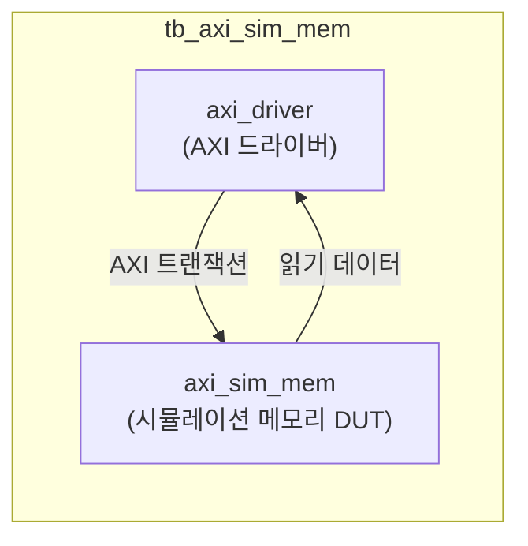
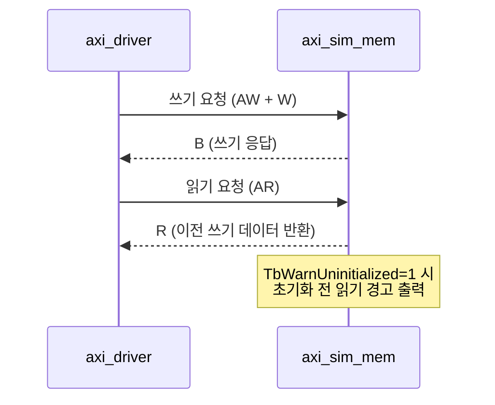

# tb_axi_sim_mem.sv

## 개요

`axi_sim_mem` 모듈의 테스트벤치입니다. 시뮬레이션용 AXI 메모리 모델의 올바른 동작(읽기/쓰기, 초기화되지 않은 데이터 경고 등)을 검증합니다.

## 테스트 구성

## 파라미터

| 파라미터 | 기본값 | 설명 |
|---------|--------|------|
| `TbTclk` | 10ns | 클록 주기 |
| `TbAddrWidth` | 64 | 주소 폭 |
| `TbDataWidth` | 128 | 데이터 폭 |
| `TbIdWidth` | 6 | ID 폭 |
| `TbUserWidth` | 2 | 사용자 신호 폭 |
| `TbWarnUninitialized` | `1'b0` | 초기화되지 않은 메모리 경고 |
| `TbApplDelay` | 2ns | 신호 적용 지연 |
| `TbAcqDelay` | 8ns | 신호 획득 지연 |

## 검증 시나리오

## 테스트 시나리오

1. `axi_driver`로 임의 주소에 쓰기 트랜잭션 생성
2. `axi_sim_mem`이 데이터 저장
3. 동일 주소 읽기 트랜잭션으로 저장된 데이터 검증
4. 초기화 전 읽기 시 경고 동작 확인 (TbWarnUninitialized=1)
5. 버스트 읽기/쓰기 트랜잭션 지원 검증

## 검증 대상

`axi_sim_mem`: 시뮬레이션 전용 AXI 메모리 모델 (지연 없는 반응)

## 의존성

- `axi/assign.svh`, `axi/typedef.svh`
- `axi_test` (axi_driver)
- `clk_rst_gen` (common_verification)
