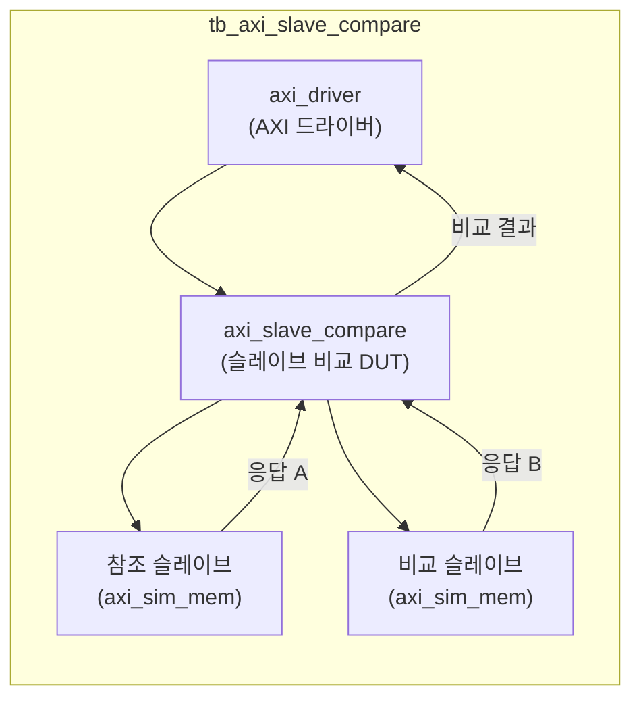
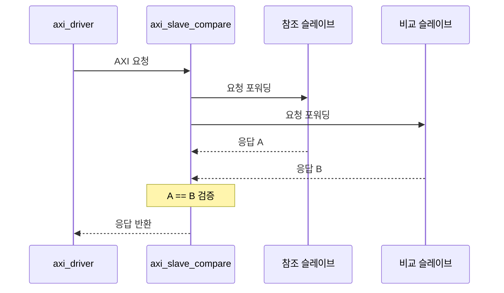

# tb_axi_slave_compare.sv

## 개요

`axi_slave_compare` 모듈의 테스트벤치입니다. 두 AXI 슬레이브의 응답을 비교하여 동등성을 검증합니다.

## 테스트 구성

## 파라미터

| 파라미터 | 기본값 | 설명 |
|---------|--------|------|
| `TbTclk` | 10ns | 클록 주기 |
| `TbAddrWidth` | 64 | 주소 폭 |
| `TbDataWidth` | 128 | 데이터 폭 |
| `TbIdWidth` | 6 | ID 폭 |
| `TbUserWidth` | 2 | 사용자 신호 폭 |
| `TbWarnUninitialized` | `1'b0` | 초기화 경고 |
| `TbApplDelay` | 2ns | 신호 적용 지연 |
| `TbAcqDelay` | 8ns | 신호 획득 지연 |

## 비교 로직

## 테스트 시나리오

1. `axi_driver`가 임의의 읽기/쓰기 트랜잭션 생성
2. `axi_slave_compare`가 동일 요청을 두 슬레이브로 동시 포워딩
3. 두 슬레이브의 응답 비교
4. 데이터 불일치 시 assertion 실패

## 검증 대상

`axi_slave_compare`: 두 AXI 슬레이브 응답 비교기 (골든 레퍼런스 검증용)

## 의존성

- `axi/assign.svh`, `axi/typedef.svh`
- `axi_test` (axi_driver)
- `clk_rst_gen` (common_verification)
