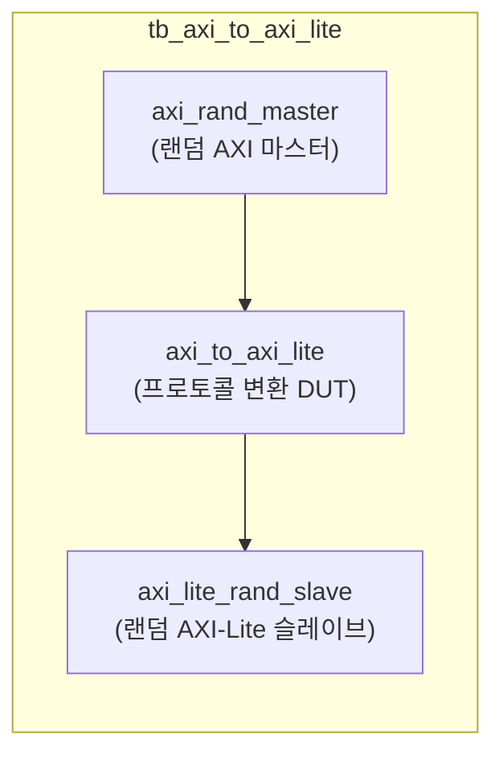
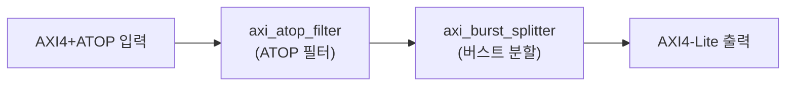

# tb_axi_to_axi_lite.sv

## 개요

`axi_to_axi_lite` 모듈의 테스트벤치입니다. AXI4+ATOP 프로토콜에서 AXI4-Lite로의 변환이 올바른지 검증합니다.

## 테스트 구성

## 파라미터

| 파라미터 | 기본값 | 설명 |
|---------|--------|------|
| `AW` | 32 | 주소 폭 |
| `DW` | 32 | 데이터 폭 |
| `IW` | 8 | ID 폭 |
| `UW` | 8 | 사용자 신호 폭 |
| `tCK` | 1ns | 클록 주기 |
| `MAX_READ_TXNS` | 20 | 최대 동시 읽기 트랜잭션 |
| `MAX_WRITE_TXNS` | 20 | 최대 동시 쓰기 트랜잭션 |
| `AXI_ATOPS` | `1'b0` | ATOP 비활성화 |

## 변환 파이프라인

## 테스트 시나리오

1. 랜덤 AXI 마스터가 읽기/쓰기 트랜잭션 생성 (ATOP 제외)
2. `axi_to_axi_lite` 변환 파이프라인:
   - `axi_atop_filter`: ATOP 트랜잭션 차단
   - `axi_burst_splitter`: 버스트를 단일 비트 요청으로 분할
   - AXI-Lite 변환: ID/user/burst 정보 제거
3. AXI-Lite 슬레이브가 응답
4. 모든 데이터가 손실 없이 전달되는지 검증

## 검증 대상

`axi_to_axi_lite`: AXI4+ATOP → AXI4-Lite 다운그레이드 변환기

## 의존성

- `axi/assign.svh`
- `axi_test`
