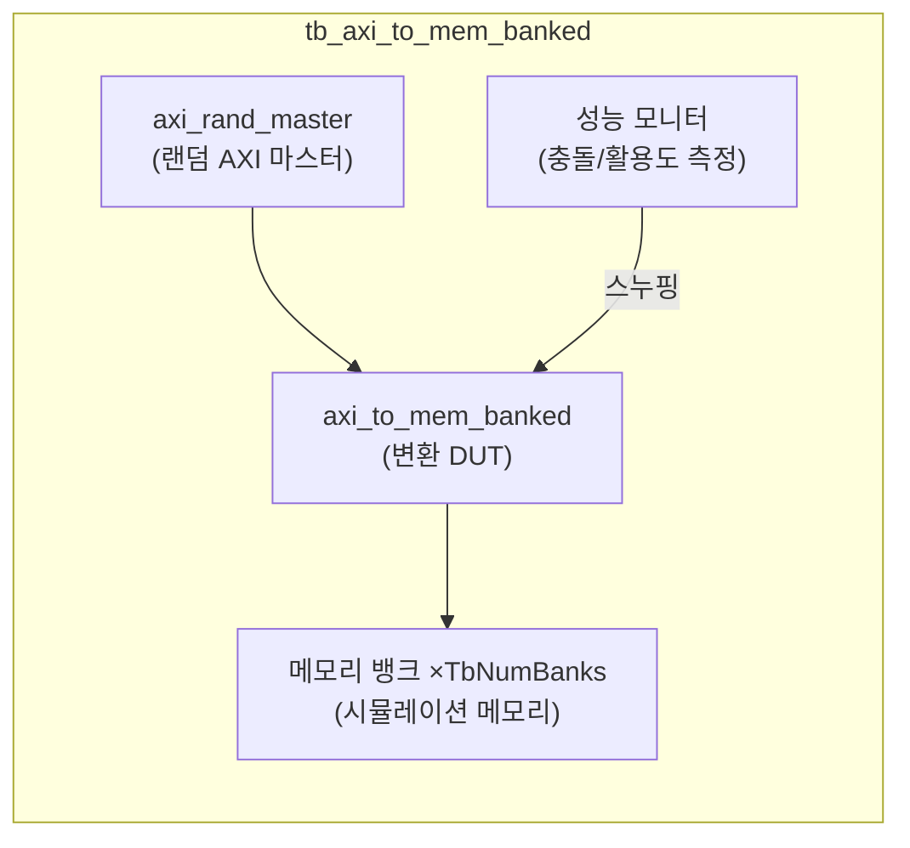
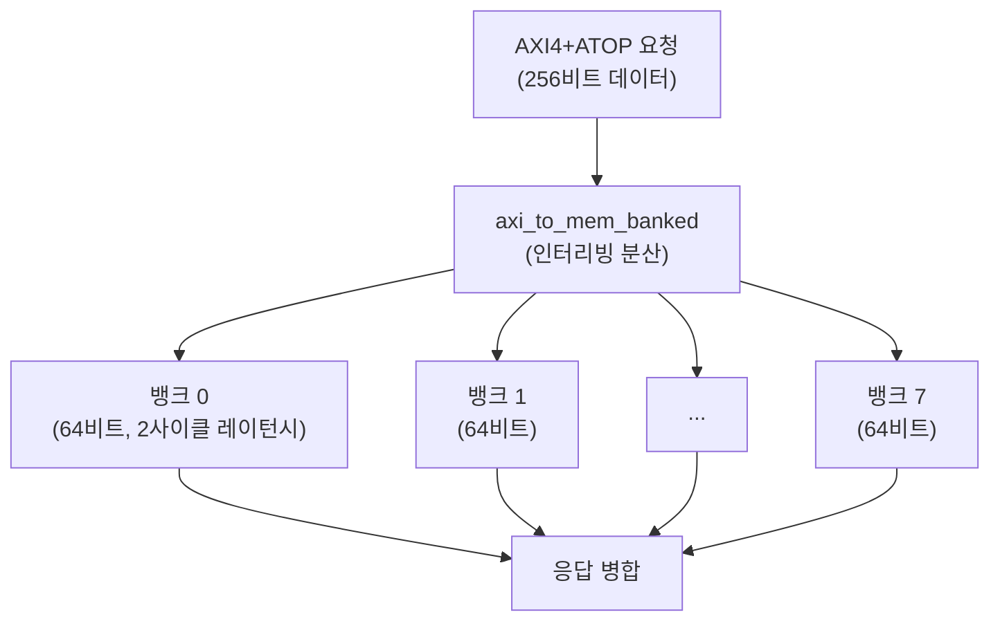

# tb_axi_to_mem_banked.sv

## 개요

`axi_to_mem_banked` 모듈의 테스트벤치입니다. AXI4+ATOP에서 뱅크드 메모리 인터페이스로의 변환 성능과 정확성을 검증합니다.

## 테스트 구성

## 파라미터

| 파라미터 | 기본값 | 설명 |
|---------|--------|------|
| `TbAxiDataWidth` | 256 | AXI 데이터 폭 |
| `TbNumWords` | 8192 | 메모리 뱅크당 워드 수 |
| `TbNumBanks` | 8 | 메모리 뱅크 수 |
| `TbMemDataWidth` | 64 | 개별 뱅크 데이터 폭 |
| `TbMemLatency` | 2 | 메모리 레이턴시 (사이클) |
| `TbNumWrites` | 10000 | 총 쓰기 트랜잭션 수 |
| `TbNumReads` | 10000 | 총 읽기 트랜잭션 수 |

## 내부 설정

| 파라미터 | 값 | 설명 |
|---------|-----|------|
| `AxiIdWidth` | 6 | ID 폭 |
| `AxiAddrWidth` | 64 | 주소 폭 |
| `AxiUserWidth` | 4 | 사용자 신호 폭 |
| `CyclTime` | 10ns | 클록 주기 |

## 메모리 뱅킹 구조

## 테스트 시나리오

1. 랜덤 AXI 마스터가 10000 쓰기 + 10000 읽기 트랜잭션 생성
2. `axi_to_mem_banked`가 요청을 8개 뱅크로 인터리빙 분산
3. 각 뱅크가 2사이클 레이턴시로 응답
4. 응답 병합 후 AXI 마스터로 반환
5. 뱅크 충돌률과 활용도 측정 및 출력

## 검증 대상

`axi_to_mem_banked`: AXI → 멀티 뱅크 메모리 인터페이스 변환기

## 의존성

- `axi/typedef.svh`, `axi/assign.svh`
- `common_cells/registers.svh`
- `axi_test`
