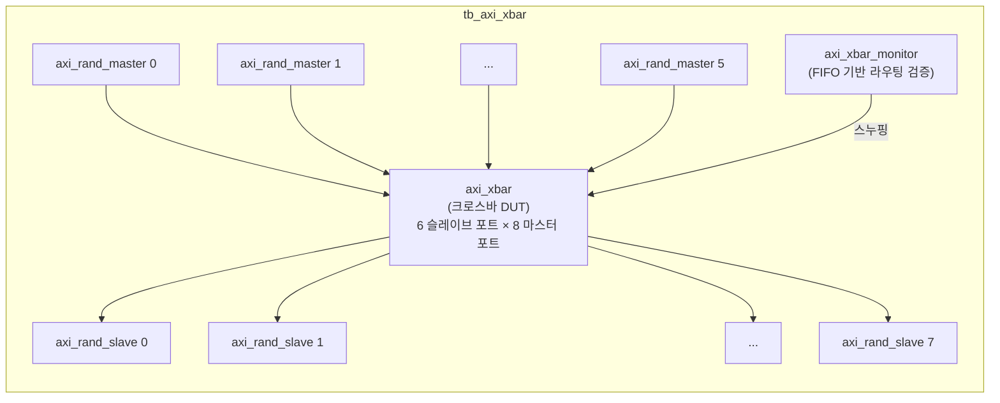
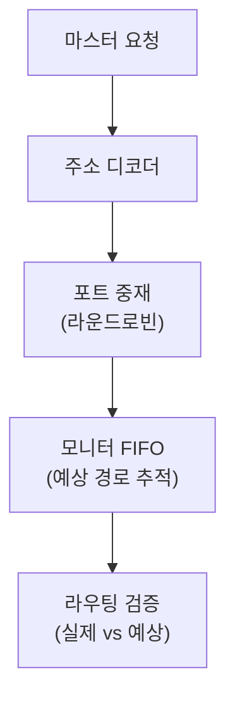

# tb_axi_xbar.sv

## 개요

`axi_xbar` 모듈의 테스트벤치입니다. Directed Random Verification 방식으로 AXI 크로스바의 라우팅 정확성과 성능을 검증합니다.

## 테스트 구성

## 파라미터

| 파라미터 | 기본값 | 설명 |
|---------|--------|------|
| `TbNumMasters` | 6 | 마스터 수 (슬레이브 포트) |
| `TbNumSlaves` | 8 | 슬레이브 수 (마스터 포트) |
| `TbNumWrites` | 200 | 마스터당 쓰기 트랜잭션 수 |
| `TbNumReads` | 200 | 마스터당 읽기 트랜잭션 수 |
| `TbAxiIdWidthMasters` | 5 | 마스터 ID 폭 |
| `TbAxiIdUsed` | 3 | 실제 사용 ID 폭 |
| `TbAxiDataWidth` | 64 | 데이터 폭 |
| `TbPipeline` | 1 | 크로스바 내부 파이프라인 스테이지 |
| `TbEnAtop` | `1'b1` | ATOP 활성화 |
| `TbEnExcl` | `1'b0` | 독점 접근 비활성화 |
| `TbUniqueIds` | `1'b0` | 유니크 ID 제한 비활성화 |

## 크로스바 라우팅 검증

## 테스트 시나리오

1. 6개의 랜덤 AXI 마스터가 동시에 포화 수준의 트랜잭션 생성 (ATOP 포함)
2. 크로스바가 주소 기반으로 8개 슬레이브 중 적절한 포트로 라우팅
3. `axi_xbar_monitor`가 FIFO와 ID 큐로 예상 경로 모델링
4. 각 트랜잭션이 예상 슬레이브에 도착하는지 검증
5. AXI 순서 규칙(ID별 트랜잭션 순서) 준수 검증

## 검증 대상

`axi_xbar`: AXI4+ATOP 완전 연결 크로스바 (6×8, 파이프라인 포함)

## 의존성

- `axi/typedef.svh`, `axi/assign.svh`
- `tb_axi_xbar_pkg` (axi_xbar_monitor)
- `axi_test`
