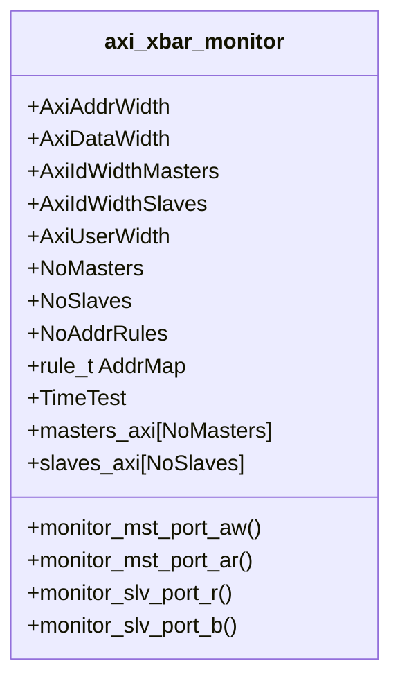
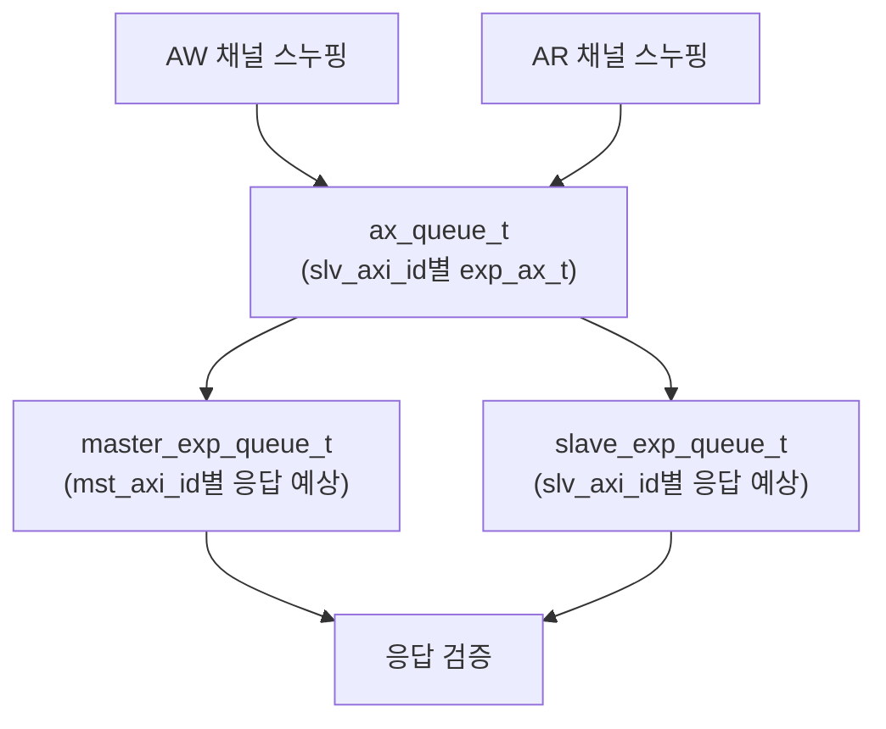

# tb_axi_xbar_pkg.sv

## 개요

`axi_xbar` 테스트벤치를 위한 공통 패키지입니다. 크로스바 전용 AXI 버스 모니터(`axi_xbar_monitor`) 클래스를 정의합니다.

## 블록 다이어그램

## 주요 클래스

### `axi_xbar_monitor`

AXI 크로스바 전용 버스 모니터입니다.

- 마스터 포트(슬레이브 접속)와 슬레이브 포트(마스터 접속)를 동시에 스누핑
- `rand_id_queue_pkg::rand_id_queue`를 사용하여 ID별 트랜잭션 추적
- FIFO 기반으로 예상 경로를 모델링하고 실제 라우팅 결과와 비교

## 내부 데이터 구조

## 타입 정의

| 타입 | 설명 |
|------|------|
| `mst_axi_id_t` | 마스터 포트 ID (AxiIdWidthMasters비트) |
| `slv_axi_id_t` | 슬레이브 포트 ID (AxiIdWidthSlaves비트) |
| `axi_addr_t` | AXI 주소 |
| `master_exp_t` | 마스터 예상 응답 구조체 {mst_axi_id, last} |
| `exp_ax_t` | 예상 AX 채널 구조체 {slv_axi_id, slv_axi_addr, slv_axi_len} |
| `slave_exp_t` | 슬레이브 예상 응답 구조체 {slv_axi_id, last} |

## 사용 대상

- `tb_axi_xbar.sv`

## 의존성

- `rand_id_queue_pkg`
- `axi_pkg`
